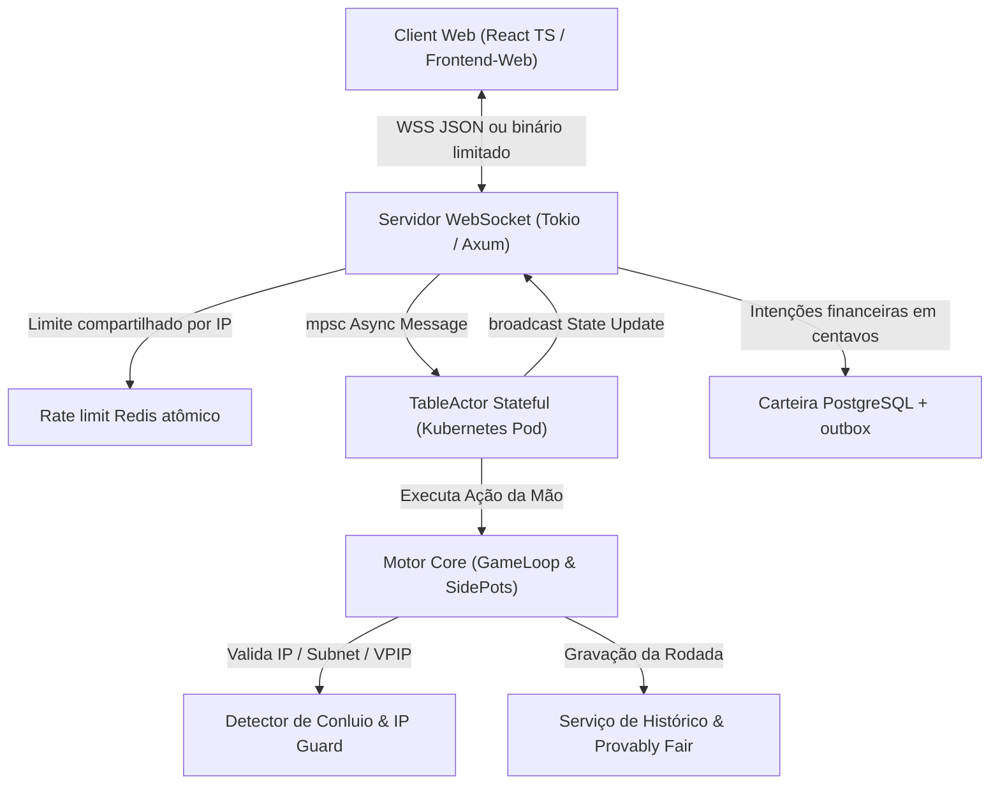

# Arquitetura Técnica & Especificação de APIs - Plataforma de Poker Online em Rust

**Atualizado:** 2026-08-31 | **Status:** Em revisão contínua — S19, catálogo canônico, sessão resiliente, DePix Sandbox protegida, migrations 030; sem certificação de produção.

Este documento consolida a arquitetura técnica, esquemas de comunicação, contratos de API e modelos de segurança da **Plataforma de Poker Online em Rust**.

> **Limite operacional atual:** `TableActor` é local ao processo. Por isso o manifesto Kubernetes mantém uma réplica até existir ownership distribuído de mesa; Redis não transforma o ator em componente multi-pod por si só.

### Lobby e carteiras (REST)

| Endpoint | Notas |
|----------|--------|
| `GET /api/lobby/tables?mode=play\|real` | Filtra `money_mode`; responde `poker_variant`, blinds, frentes |
| `POST /api/lobby/join` | Body: `table_id`, `buy_in`, `wallet_mode` — rejeita PM em mesa Real e vice-versa |
| `GET /api/lobby/tournaments?mode=…` | Catálogo com `money_mode` + `poker_variant` |
| `POST /api/tournament/register` | Debita carteira conforme modo |

`poker_variant`: `holdem` \| `short_deck` \| `short_deck_omaha`.  
Motor: `TableConfig.small_blind` + `big_blind` (SB pode = BB); Short Deck Omaha deal 4 hole cards.

---

## 🏛️ 1. Arquitetura de Alto Nível do Sistema



---

## ⚡ 2. Especificação do Protocolo WebSocket em Tempo Real

### 📩 Pacote de Entrada (`WsIncomingPacket`)

```json
{
  "action": "raise",
  "amount": 15000
}
```

Ações suportadas:
- `JoinTable { "table_id": "Table_1", "ip_address": "203.0.113.88" }`
- `raise`, `bet` e `call` usam `amount` em centavos inteiros (`15000` = R$ 150,00).
- `fold`, `check` e `call` não aceitam valor fracionário.
- O servidor aceita também um envelope binário com tamanho máximo de 64 KiB; cargas inválidas, truncadas ou com bytes excedentes são rejeitadas.

### 📢 Pacote de Saída Broadcast (`WsOutgoingPacket`)

```json
{
  "event_type": "table_state",
  "table_id": "Table_1",
  "payload": { "players": [] }
}
```

- O estado transmitido é filtrado para cada destinatário: cartas privadas de oponentes e campos sensíveis (`server_seed`, segredos MFA, hashes e tokens) não saem pelo WebSocket.
- `Ping`/`Pong` é tratado tanto pelo protocolo WebSocket quanto pelo envelope binário; o ping JSON recebe `pong` de aplicação.
- Atores medem 30 segundos por turno e aplicam `fold` automático apenas a um turno realmente ativo. A rotação do dealer é ancorada no assento físico anterior, inclusive após uma saída.

### Evento `deflator_triggered` (broadcast público)

Emitido **uma vez por perdedor** elegível ao Loss Deflator após a liquidação da mão (cash game). Campos:

| Campo | Tipo | Escala / significado |
|-------|------|----------------------|
| `type` | string | sempre `"deflator_triggered"` |
| `loser_name` / `winner_name` | string | nomes de exibição |
| `cashback_amount` | u64 | centavos devolvidos |
| `deflator_percent` | u8 | **7 / 15 / 25 / 35** (tier de cashback) |
| `loser_equity_percent` | f64 | equity do perdedor **0–100** com 2 casas |
| `odds_broken` | u8 | compat: ~% de “upset” do vencedor `(1 - equity)×100` — **não** é o tier |
| `opponents_counted` | u8 | 1 = heads-up; 2+ = equity multiway |
| `prevented_elimination` | bool | stack final do perdedor == cashback |
| `is_tournament` | bool | `false` no path cash do `TableActor` |

Motor interno usa equity em **0.0..=1.0**; o wire expõe percentuais **0–100**. Ordem financeira: potes → rake → Loss Deflator → pagamentos. Auditoria também em `hand_history.loss_deflators_json`.

---

## 🔒 3. Carteira, intenções PIX e auditoria

O módulo financeiro usa `wallet_transactions`, `audit_logs` e `outbox_events` no PostgreSQL. Ele ainda não é um livro de partidas dobradas nem uma cadeia de hashes: essas propriedades não são alegadas até existirem no esquema e em uma auditoria independente.

#### DePix Sandbox (somente ambiente não produtivo)

- `POST /api/payments/pix/deposit` cria checkout com `Idempotency-Key` UUID, valor em centavos e CPF/CNPJ encaminhado à DePix sem persistência ou log local.
- `GET /api/payments/pix/deposit/:tx_id` reconcilia o status do checkout; `POST .../:tx_id/simulate` existe apenas em `ENVIRONMENT=development` e para usuário allowlisted.
- O adaptador aceita exclusivamente `PIX_PROVIDER=depix`, `PIX_MODE=sandbox`, chave `sk_test_` e origem `https://api.depixapp.com`; produção DePix é rejeitada pelo código.
- O webhook valida HMAC sobre `timestamp.raw_body`, aplica janela de 5 minutos, confere cabeçalhos/evento/cobrança/valor e deduplica `event_id` em `payment_webhook_events` sem guardar o payload bruto.
- Somente `checkout.completed` credita `balance_real`. Estados `pending`, `processing` e `approved` nunca liberam saldo; cancelamento e expiração encerram apenas intenções ainda pendentes.
- O instalador local `scripts/install-depix-local-secrets.ps1` valida a chave em `/api/me` e grava os segredos somente no `.env` ignorado pelo Git.

Referências técnicas: [Documentação DePix](https://depixapp.com/docs/) e [OpenAPI DePix](https://depixapp.com/openapi.json).

### Invariantes Financeiras & Arquitetura Monetária:
1. **Arquitetura Estrita `u64` Centavos Inteiros:**
   - **Interface Pública, Axum & Frontend-Web:** A comunicação WebSocket, payloads JSON Serde, banco de dados PostgreSQL e estruturas de mesa trafegam e armazenam valores numéricos estritamente em **centavos inteiros (`u64`)** (`R$ 150,00` = `15000` centavos). Erros de arredondamento IEEE-754 flutuantes são totalmente eliminados na raiz.
   - **Cálculos de Pote & Ledger Imutável:** Todas as divisões de potes empatados (*split pots* via `dividir_pote_empatado()`), deduções de rake e registros de auditoria utilizam matemática inteira exata em centavos.
2. **Eliminação de Artefatos IEEE 754:** Operações numéricas utilizam matemática inteira de centavos e aplicam o resto (`total_centavos % N`) conforme a **Regra do Centavo Ímpar (WSOP / TDA Regra 68)**.
3. **Garantia Atômica:** O `UPDATE ... WHERE balance >= amount` reserva um saque sem permitir saldo negativo; a linha da carteira e o evento de outbox entram na mesma transação.
4. **Depósito idempotente:** antes de criar a cobrança, a API grava uma linha `PENDING` com chave de idempotência. O webhook HMAC-SHA256 bloqueia essa linha (`FOR UPDATE`), confere valor e identificador externo persistidos e credita o saldo junto com a transição para `COMPLETED` em uma única transação.
5. **Chaves PIX:** a chave bruta não é persistida; somente sua impressão SHA-256 é registrada. O saque fica `PENDING` no outbox e não chama um provedor de payout durante a requisição HTTPS.

### Presença online (plataforma)

Contador de usuários **logados** com heartbeat recente — distinto dos assentos por mesa.

| Endpoint | Auth | Função |
|----------|------|--------|
| `GET /api/presence/online` | público | `{ online_count, ttl_seconds }` — amizades veem quantos estão logados |
| `POST /api/presence/heartbeat` | JWT (`RequireAuth`) | renova presença do usuário e devolve a contagem |

- **TTL:** 90 segundos sem heartbeat ⇒ some da contagem.
- **Backend:** Redis ZSET `poker:presence:online` (score = epoch); fallback `HashMap` em memória se Redis ausente (lab/testes).
- **Frontend:** `OnlinePresenceNav` (header, todas as páginas) + `OnlinePresenceHero` (home); clientes autenticados enviam heartbeat ~25s e ao focar a aba.
- **Regra de jogo:** o contador **não** inicia mão; a mesa ainda exige **≥ 2 assentos ACTIVE** na mesma mesa.

### Operação de mesas cash

- O assento ativo é a fonte de verdade no PostgreSQL: `POST /api/lobby/join` exige JWT e `buy_in` em centavos; débito de carteira, escrow, ledger e ocupação são atômicos.
- O contador público de jogadores **por mesa** é uma projeção mantida por gatilho dos assentos `ACTIVE`; o banco rejeita capacidade, blinds, buy-ins e estados de mesa inválidos.
- `POST /api/lobby/leave` só liquida entre mãos, transferindo o stack persistido de volta à carteira e registrando o cash-out.
- O WebSocket aceita apenas o dono de um assento ativo e financiado em mesa `OPEN`; não fornece stack de demonstração.
- O navegador primeiro solicita `POST /api/lobby/tables/:id/ws-ticket` com Bearer JWT. O WebSocket recebe somente o ticket opaco, vinculado à mesa, com validade de 60 segundos e consumo único (Redis quando configurado).
- Redis é obrigatório em produção para que tickets e snapshots de mesa não se dividam entre réplicas; o fallback em memória existe apenas para desenvolvimento/testes locais.
- Administradores criam mesas com `POST /api/admin/tables` e alteram o estado com `PATCH /api/admin/tables/:id/status`. Uma mesa só fecha sem assentos ativos; `PAUSED` bloqueia novas entradas, e `OPEN` permite novas conexões.
- O histórico recebe número sequencial atômico por mesa, blinds reais da configuração e participantes na mesma transação; a assinatura usa o segredo já validado pela aplicação, sem chave de fallback.

### Endpoints Administrativos B2B SaaS (Clube & White-Label)

- `POST /api/admin/clubs`: Criação de um novo clube na rede B2B com subdomínio dinâmico e tema inicial.
- `GET /api/admin/clubs`: Lista todos os clubes registrados e seus status na plataforma.
- `GET /api/admin/clubs/:id/financials`: Retorna o extrato financeiro do clube: saldo acumulado (`balance`), Rake Líquido do Clube (85%), Fee da Plataforma (15%) e Rake Bruto.
- `POST /api/admin/clubs/:id/withdraw`: Solicita o saque das comissões do saldo acumulado do clube via chave PIX.
- `PUT /api/admin/clubs/:id/theme`: Atualiza o JSON de personalização visual (`custom_theme_json`) para a injeção do tema White-Label no Frontend.
- `GET /api/admin/clubs/:id/agents`: Lista agentes ativos do clube (rakeback %, indicados, comissão em centavos).
- `POST /api/admin/clubs/:id/agents`: Cadastra agente com nome e rakeback 0–50%; persiste em `club_agents` e registra audit log.
- **Cliente canônico:** o dashboard `/admin/clubs` em `Frontend-Web` consome esses endpoints via **HTTPS** same-origin (`api/client.ts` + JWT admin).

### Autorização revogável e distribuída

- O JWT contém `token_version`. A migration `009_auth_token_version.sql` incrementa essa versão quando status, papel, MFA ou hash de senha mudam.
- Todo endpoint protegido consulta o registro persistido para status, papel e versão antes de autorizar. Assim suspensão, banimento, rebaixamento ou mudança de MFA revogam tokens já emitidos em todas as réplicas.
- O limite por IP usa script atômico no Redis em produção; o limitador em memória é um fallback exclusivo de desenvolvimento quando Redis não foi configurado.


---

## 🎲 4. Protocolo Criptográfico Provably Fair (Baralho Transparente)

1. **Pré-Jogo:** O servidor gera a `ServerSeed` e envia o Hash comprometido:
   $$\text{ServerSeedHash} = \text{SHA256}(\text{ServerSeed})$$
2. **Embaralhamento Determinístico:** O baralho de 52 cartas é ordenado usando o PRNG ChaCha8:
   $$\text{ChaCha8Seed} = \text{HMAC-SHA256}(\text{ServerSeed}, \text{ClientSeed} \parallel \text{Nonce})$$
3. **Pós-Jogo:** A `ServerSeed` original é revelada no histórico de mãos (exportável no padrão internacional PokerStars), permitindo que qualquer jogador reconstrua a semente e comprove que o baralho foi 100% honesto.

---

## 🛡️ 5. Módulo Antifraude & Gestão de Risco

1. **Subnet /24 Guard:** Impede que dois ou mais jogadores no mesmo IP estrito ou na mesma sub-rede IPv4 `/24` entrem na mesma mesa.
2. **Análise de Anomalias (VPIP / PFR):** Rastreia métricas estatísticas comportamentais:
   - Alerta disparado se $\text{VPIP} > 85\%$ ou $\text{PFR} > 70\%$ após amostragem mínima.
3. **Bloqueio Administrativo:** O `AdminDashboard` permite o banimento instantâneo de contas suspeitas com congelamento de fundos no Ledger.

---

## 📊 6. Readiness e métricas observáveis

- `/health` só responde `OK` após verificar PostgreSQL e, quando configurado, Redis.
- `/api/metrics` exige papel administrativo e publica somente valores que o processo mede: uptime, WebSockets ativos e atores de mesa ativos.
- Não há benchmark de release certificado neste repositório. Throughput, latência e capacidade devem ser obtidos exclusivamente em uma execução autorizada da validação completa, com o TSV de evidência gerado pelos scripts.

<!-- DOCUMENTATION_SYNC:START -->
> **Estado operacional sincronizado (2026-09-01):** S20 — Big Blind Ante 26 níveis nos torneios + potes laterais com ante morto; cash permanece sem ante; catálogo cash canônico NLHE 0,25/0,25, Hold'em Short Deck 0,25/0,50 e Omaha Short Deck 0,50/0,50 (Play Money e Jogo Real). **Sem certificação de produção; o código rejeita PIX em modo production. Deploy público: VPS Hostinger (demo/staging) com domínio zerotiltpoker.net. Staging/demo apenas; não alegar Launch Ready de produção.** Stack Docker local 4/4 healthy e VPS Hostinger 4/4 healthy (poker_api/poker_frontend/poker_postgres/poker_redis); migrations 001–032 aplicadas (BBA). Gate S20: cargo fmt, Clippy estrito (Motor + API), 1828 testes Motor-Rust (incl. 3 BBA) + 35 testes API-Axum + TypeScript tsc + Vite build — todos sem falhas; VPS validado com 6 torneios 26 níveis ante=big_blind (invalid_BBA=0), backup verificável, rebuild 4m13s e health público OK. Mantidas evidências de stress Short Deck e catálogo cash. A VPS permanece no padrão seguro PIX mock. DePix existe somente em Sandbox não produtivo, com chave sk_test_, allowlist de depositante, idempotência, HMAC com janela temporal, deduplicação de eventos e crédito apenas em checkout.completed. O CPF/CNPJ é encaminhado ao provedor sem persistência local. Depósito manual continua como fallback; não há saque automático. Mesas com dono único por processo; settlement assinado (HMAC) na liquidação.
>
> Fonte canônica: [`STATUS_OPERACIONAL.json`](STATUS_OPERACIONAL.json). Verificação: `cargo run --bin documentation-sync -- --check`.
<!-- DOCUMENTATION_SYNC:END -->
