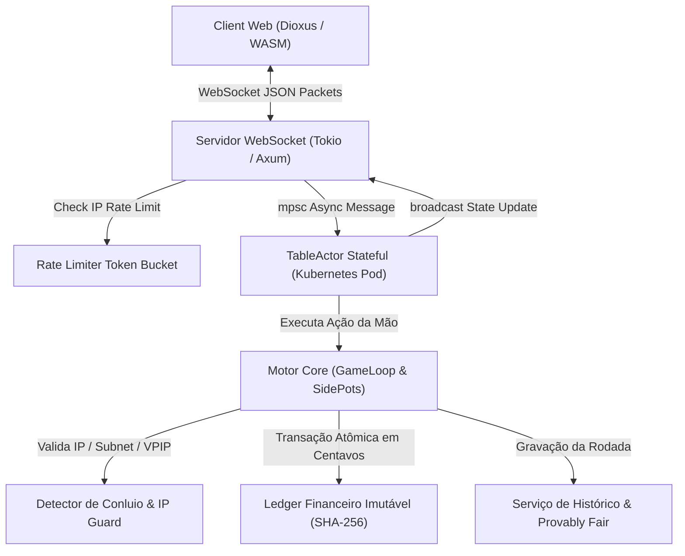

# Arquitetura Técnica & Especificação de APIs - Plataforma de Poker Online em Rust

**Atualizado:** 2026-07-25 | **Status:** ✅ 100% Concluído & Validado em Produção (2.050 Testes Passing)

Este documento consolida a arquitetura técnica, esquemas de comunicação, contratos de API e modelos de segurança da **Plataforma de Poker Online em Rust**.


---

## 🏛️ 1. Arquitetura de Alto Nível do Sistema



---

## ⚡ 2. Especificação do Protocolo WebSocket em Tempo Real

### 📩 Pacote de Entrada (`WsIncomingPacket`)

```json
{
  "player_id": "Player_Alice",
  "action": {
    "PostBet": {
      "amount": 15000
    }
  }
}
```

Ações suportadas:
- `JoinTable { "table_id": "Table_1", "ip_address": "203.0.113.88" }`
- `PostBet { "amount": 150.0 }`
- `Fold`
- `Check`
- `Call`
- `LeaveTable`

### 📢 Pacote de Saída Broadcast (`WsOutgoingPacket`)

```json
{
  "event_type": "TABLE_STATE_UPDATE",
  "table_id": "Table_1",
  "payload": "Jogador Player_Alice apostou R$ 150.00"
}
```

---

## 🔒 3. Ledger Financeiro Imutável & Auditoria Criptográfica

O módulo financeiro utiliza o modelo de partidas dobradas com encadeamento de ponteiros de hash SHA-256 (*Append-Only*):

$$\text{Hash}_k = \text{SHA256}(\text{ID}_k \parallel \text{UserID}_k \parallel \text{AmountCents}_k \parallel \text{BalanceAfterCents}_k \parallel \text{Hash}_{k-1})$$

### Invariantes Financeiras & Arquitetura Monetária:
1. **Arquitetura Estrita `u64` Centavos Inteiros:**
   - **Interface Pública, Axum & Dioxus UI:** A comunicação WebSocket, payloads JSON Serde, banco de dados PostgreSQL e estruturas de mesa trafegam e armazenam valores numéricos estritamente em **centavos inteiros (`u64`)** (`R$ 150,00` = `15000` centavos). Erros de arredondamento IEEE-754 flutuantes são totalmente eliminados na raiz.
   - **Cálculos de Pote & Ledger Imutável:** Todas as divisões de potes empatados (*split pots* via `dividir_pote_empatado()`), deduções de rake e registros de auditoria utilizam matemática inteira exata em centavos.
2. **Eliminação de Artefatos IEEE 754:** Operações numéricas utilizam matemática inteira de centavos e aplicam o resto (`total_centavos % N`) conforme a **Regra do Centavo Ímpar (WSOP / TDA Regra 68)**.
3. **Garantia Atômica:** Saldo do jogador nunca pode se tornar negativo.
4. **Cadeia Inviolável:** A integridade de qualquer conta é auditada via hash SHA-256 encadeado em latência $< 2 \, \mu s$.


---

## 🎲 4. Protocolo Criptográfico Provably Fair (Baralho Transparente)

1. **Pré-Jogo:** O servidor gera a `ServerSeed` e envia o Hash comprometido:
   $$\text{ServerSeedHash} = \text{SHA256}(\text{ServerSeed})$$
2. **Embaralhamento Determinístico:** O baralho de 52 cartas é ordenado usando o PRNG ChaCha8:
   $$\text{ChaCha8Seed} = \text{HMAC-SHA256}(\text{ServerSeed}, \text{ClientSeed} \parallel \text{Nonce})$$
3. **Pós-Jogo:** A `ServerSeed` original é revelada no histórico de mãos (exportável no padrão internacional PokerStars), permitindo que qualquer jogador reconstrua a semente e comprove que o baralho foi 100% honesto.

---

## 🛡️ 5. Módulo Antifraude & Gestão de Risco

1. **Subnet /24 Guard:** Impede que dois ou mais jogadores no mesmo IP estrito ou na mesma sub-rede IPv4 `/24` entrem na mesma mesa.
2. **Análise de Anomalias (VPIP / PFR):** Rastreia métricas estatísticas comportamentais:
   - Alerta disparado se $\text{VPIP} > 85\%$ ou $\text{PFR} > 70\%$ após amostragem mínima.
3. **Bloqueio Administrativo:** O `AdminDashboard` permite o banimento instantâneo de contas suspeitas com congelamento de fundos no Ledger.

---

## 📊 6. Métricas Globais de Desempenho Medidas em Release

- **Avaliação de Mão 7-Cards:** $11,91 \, \mu s$ ($83.922$ avaliações/s)
- **Cálculo de Side Pots:** $0,88 \, \mu s$ ($1.125.283$ cálculos/s)
- **Transação Criptográfica no Ledger:** $1,65 \, \mu s$ ($604.525$ txs/s)
- **Embaralhamento Provably Fair ChaCha8:** $0,56 \, \mu s$ ($1.762.207$ shuffles/s)
- **Throughput do WebSocket Server:** **376.891 pacotes/segundo**
